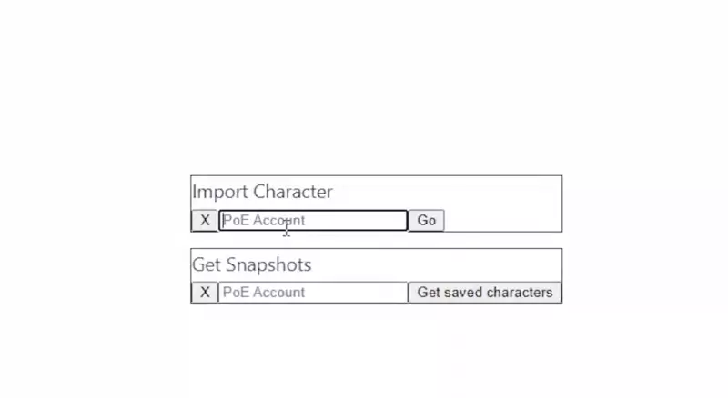

# Path of Exile character snapshots

This is a simple web app that allows you to take a snapshot of your character and see how it has changed over time.

Fetch character from pathofexile.com, display inventory and some statistics with charts.

## How to use

### 1. Install dependencies

```bash
pip install -r requirements.txt
cd frontend
npm install
```

In addition you need LuaJIT and [PathOfBuilding](https://github.com/PathOfBuildingCommunity/PathOfBuilding).

And copy `rsc/ProcessJson.lua` to `PathOfBuilding/src/ProcessJson.lua`.

### 2. Run DRF server

```bash
cd backend
python manage.py runserver
```

### 3. Run Vue server

```bash
cd frontend
npm run dev
```

### 4. Open browser

Open the address that appears in the terminal after you start the Vue server.

## Usage example



## Docker

You can use docker to run the app.

Clone the PoB repo into root of this project.
```bash
git clone https://github.com/PathOfBuildingCommunity/PathOfBuilding.git
```
Build the docker image.
```bash
docker build -t poe_snapshot .
```
Run docker compose.
```bash
docker-compose up
```
